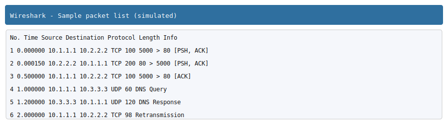

# CA-WAN FOR NS-3 ✅

**Repository summary**

This repository contains a set of network simulation scenarios (organized by exercise number) used with NS-3 (C++ simulation scripts), accompanying XML scenario files, .pcap traces captured from runs, and small config files. The files were renamed to keep the exercise numbers while changing descriptive parts to topic-related synonyms — full rename mappings are recorded in `exercise_renames.txt` and `exercise_renames_synonyms.txt`.

---

## What this repo contains 🔎

- `exerciseNN-*.cc` — NS-3 C++ simulation scripts (exercise-number prefixed)
- `exerciseNN-*.xml` — XML scenario/config files for some simulations
- `exerciseNN-*.pcap` — packet capture outputs from runs (viewable with Wireshark)
- `exerciseNN-*.routes`, `.json`, `.txt` — supplemental config/metrics files
- `exercise_renames.txt` and `exercise_renames_synonyms.txt` — mappings of original and renamed filenames

> Note: I renamed files to make the descriptions related to the original topics but not identical; consult the mapping files before updating references in scripts or docs.

---

## How the simulations work (overview) ⚙️

1. Each `exerciseNN-*.cc` script implements a specific network topology and experiment using NS-3 constructs (nodes, channels, helpers, Internet stack, routing, and applications).
2. Some scenarios use `.xml` files as input or export (topology data, routing tables, or scenario descriptions).
3. Running a simulation typically produces `.pcap` traces (pcap files) and optional text metrics written by the scenario (through FlowMonitor, tracing sinks, or custom logging).
4. PCAP files capture the packet-level traffic produced by the simulation and can be inspected using Wireshark or tcpdump.

---

## Quick start — run a simulation locally ▶️

1. Install NS-3 (recommended stable release). See https://www.nsnam.org/ for the official instructions.
2. Copy or move the `.cc` file you want to run into your NS-3 `scratch/` directory (or add it to a module).
3. Build NS-3 and run the script:

```bash
# In your ns-3 root directory
./waf configure --enable-examples --enable-tests
./waf build
# Run a copied script named `exercise03-example.cc` (example)
./waf --run scratch/exercise03-example
```

4. After the run, check for `.pcap` outputs in the working directory, or look at `stdout`/`log` files for metrics.

Tip: Some scripts support command-line arguments (seed, runtime, enable-tracing). Open the `.cc` file and check its `main()` for details.

---

## Inspecting traces and metrics 🔍

- Open `.pcap` files with Wireshark: `wireshark exercise03-...pcap` or use `tcpdump -r file.pcap` to inspect from CLI.
- FlowMonitor outputs (if used) are typically saved to XML or printed as text; parse these with the included ns-3 helper utilities.

---

## Reproducing and debug tips 🧭

- Use a fixed RNG seed when you need exact reproducibility.
- Increase logging verbosity or enable tracing options in the `.cc` file to capture more internal events.
- If an XML file references filenames, update those references if you rename files (use the rename mapping files).

---

## Files renamed — mapping files 📁

- `exercise_renames.txt` — original → intermediate (random names) mapping saved in the workspace
- `exercise_renames_synonyms.txt` — original → intermediate → synonym-based mapping (final names)

Use these to locate a renamed file or to revert/adjust any references.

---

## Contributing & support 🤝

- If you'd like the README altered (tone, more technical details, screenshots, example outputs), tell me what to add and I will update it.
- For updates to internal references (XML or scripts), I can update them automatically using the mapping files if you want.

---

## License & author ✍️

This repository does not include an explicit license file. Add a LICENSE if you want a formal license (e.g., MIT). If you want, I can add `LICENSE: MIT` with your name.

---

## Examples & sample outputs 📸

To help you get started quickly, this repository includes a small `examples/` folder with sample outputs and a placeholder Wireshark screenshot.

- `examples/flowmon_sample.txt` — a small *FlowMonitor* summary (throughput, packets, delay, jitter, loss).

- `examples/pcap_tcpdump_sample.txt` — a short `tcpdump`-style packet listing extracted from a `.pcap` file.

- `examples/wireshark_sample.svg` — a simple SVG placeholder that mimics a Wireshark packet list screenshot (useful for README or documentation).

Quick previews:

FlowMonitor sample:

```text
Flow ID: 1
Src Addr: 10.1.1.1
Dst Addr: 10.2.2.2
Tx Packets: 1000
Rx Packets: 998
Lost Packets: 2
Throughput: 1.25 Mbps
Average Delay: 3.2 ms
```

Tcpdump / pcap sample:

```text
09:00:00.123456 IP 10.1.1.1.5000 > 10.2.2.2.80: Flags [P.], seq 1:101, ack 1, win 65535, length 100
09:00:00.223456 IP 10.2.2.2.80 > 10.1.1.1.5000: Flags [P.], seq 1:201, ack 101, win 65535, length 200
...
```

Screenshot placeholder (click to open):



---

*Created and pushed by the maintainer script.*
